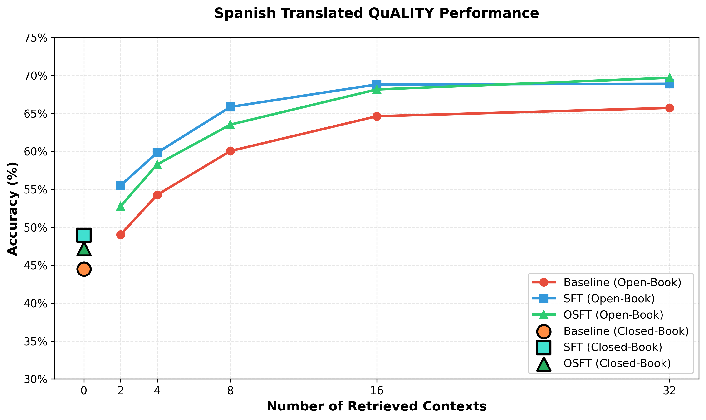

# Spanish Knowledge Tuning Flows

Spanish-language translations of the [Enhanced Multi-Summary QA](../../) flows for knowledge tuning.
These flows follow the exact same pipeline architecture as the English originals -- all prompts are translated to Spanish, the generated QA data is in Spanish.

This serves as a reference implementation for adapting the knowledge tuning flows to other languages.

## Available Flows

| Flow | Registry ID | Description |
|------|-------------|-------------|
| Extractive Summary | `epic-jade-656-es` | Extractive summary → Q&A generation |
| Detailed Summary | `mild-thunder-748-es` | Detailed summary → Q&A generation |
| Key Facts | `heavy-heart-77-es` | Atomic facts extraction → Q&A generation (5 QA pairs per fact) |
| Document Based QA | `stellar-peak-605-es` | Direct document → Q&A generation |

## Seed Data Format

The input dataset must contain Spanish-language documents with in-context learning examples.
All text content should be in Spanish, except `document_outline` and `domain` which may remain in English or categorical.

| Column | Language | Description |
|--------|----------|-------------|
| `document` | Spanish | Full document text, translated to Spanish |
| `document_outline` | English | Document title/identifier (kept in English) |
| `domain` | English | Domain classification (e.g., `articles/essays`) |
| `icl_document` | Spanish | In-context learning example document(s) |
| `icl_query_1` | Spanish | First ICL example question |
| `icl_query_2` | Spanish | Second ICL example question |
| `icl_query_3` | Spanish | Third ICL example question |

**Note:** The `icl_query_*` columns are only required by the extractive summary, detailed summary,
and document based QA flows. The key facts flow only requires `document`, `document_outline`, and `domain`.

### Example record (abbreviated)

```json
{
  "document_outline": " Defining Decay Down by David Plotz",
  "domain": "articles/essays",
  "document": "\"Definiendo la decadencia\", David Plotz, 1999. ...",
  "icl_document": "['La ciudad costera de Willow Creek...', 'Tecnólogos de la universidad local...']",
  "icl_query_1": "¿Cómo aborda la solución tecnológica los desafíos económicos *y* ambientales...?",
  "icl_query_2": "¿Qué valores o prioridades implícitos reflejan las acciones de la comunidad...?",
  "icl_query_3": "Imagina que el proyecto de la boya tiene éxito. ¿Qué consecuencias no intencionadas...?"
}
```

## Usage

The Spanish flows are auto-discovered by the `FlowRegistry` and can be used exactly like
the English flows. Just reference the Spanish flow name or ID:

```python
from sdg_hub import Flow, FlowRegistry

# Discover all available flows
FlowRegistry.discover_flows()

# Load a Spanish flow by name or ID
flow_path = FlowRegistry.get_flow_path(
    "Extractive Summary Knowledge Tuning Dataset Generation Flow (Spanish)"
)
flow = Flow.from_yaml(flow_path)

# Configure model and run (same as English flows)
flow.set_model_config(model="hosted_vllm/meta-llama/Llama-3.3-70B-Instruct",
                      api_base="http://localhost:8000/v1",
                      api_key="EMPTY")

# Load your Spanish seed data
from datasets import load_dataset
seed_data = load_dataset("json", data_files="seed_data_spanish.jsonl", split="train")

# Generate
generated_data = flow.generate(seed_data.to_pandas(), max_concurrency=50)
```

You can also search for all Spanish flows by tag:

```python
spanish_flows = FlowRegistry.search_flows(tag="spanish")
```

For a complete walkthrough, refer to the
[English knowledge generation notebook](../../../../../examples/knowledge_tuning/enhanced_summary_knowledge_tuning/knowledge_generation.ipynb) —
the usage is identical, just substitute the Spanish flow names.

## Expected Behavior

- **Output columns** are identical to the English flows (`summary`, `question`, `response`,
  `raw_document`, `faithfulness_explanation`, `faithfulness_judgment`)
- **Generated content** (summaries, questions, answers) will be in Spanish
- **Structural parsing tags** (e.g., `[QUESTION]`, `[END]`) remain in English for compatibility
  with the block pipeline
- **Faithfulness filtering** works the same way — responses are evaluated and filtered by `YES`/`NO`
  judgment

## Experiment Results

We evaluated the Spanish knowledge tuning data by training models with two methods
(**SFT** and **OSFT**) and measuring accuracy on the Spanish-translated
[QuALITY](https://github.com/nyu-mll/quality) benchmark in both open-book and closed-book settings.



### Open-Book Accuracy (%) by Number of Retrieved Contexts

| Contexts | Baseline | SFT   | OSFT  |
|----------|----------|-------|-------|
| 0(No-Rag)| 44.47    | 48.92 | 47.16 |
| 2        | 49.01    | 55.49 | 52.75 |
| 4        | 54.25    | 59.81 | 58.26 |
| 8        | 60.03    | 65.84 | 63.51 |
| 16       | 64.61    | 68.80 | 68.14 |
| 32       | 65.71    | 68.88 | 69.68 |

Both **SFT** and **OSFT** consistently outperform the baseline across all context settings
