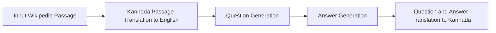

# Translation Flow for Knowledge Tuning

This example demonstrates how to use the SDG Hub translation flow to generate synthetic question-answer pairs from multilingual documents. The flow translates documents from source languages (like Kannada) to English, generates question-answer pairs in English, and then translates them back to the source language. It supports both IndicTrans2 and NLLB translation models. 

## Table of Contents
- [Overview](#overview)
- [Generation Pipeline Overview](#generation-pipeline-overview)
- [Available Translation Servers](#available-translation-servers)
- [Running the Pipeline](#running-the-pipeline)
  - [Prerequisites](#prerequisites)
  - [Starting Translation Servers](#starting-translation-servers)
  - [Using the Flow](#using-the-flow)
- [Example Output](#example-output)

## Overview

The translation flow provides a complete pipeline for multilingual knowledge generation:

- **Document Translation**: Translate source documents to English using IndicTrans2 or NLLB models
- **Q&A Generation**: Generate question-answer pairs in English using LLMs
- **Back Translation**: Translate generated Q&A pairs back to the source language
- **Flow-based Architecture**: Uses SDG Hub's declarative YAML flow configuration

## Generation Pipeline Overview



## Available Translation Servers

The flow supports two translation backends:

### 1. IndicTrans2 Server (`indic_trans_server.py`)
- **Models**: 
  - `ai4bharat/indictrans2-indic-en-dist-200M` (Indic → English)
  - `ai4bharat/indictrans2-en-indic-dist-200M` (English → Indic)
- **Languages**: Supports 22 Indian languages
- **Usage**: Best for Indian language translations

### 2. NLLB Server (`nllb_server.py`)
- **Model**: `facebook/nllb-200-1.3B`
- **Languages**: Supports 200+ languages
- **Usage**: Better for broader multilingual support

Both servers provide OpenAI-compatible APIs at `/v1/completions`.

## Running the Pipeline

### Prerequisites
Install the required packages:
```bash
pip install -r requirements.txt
```

### Starting Translation Servers

#### Option 1: IndicTrans2 Server (for Indian languages)
1. Install IndicTrans2 dependencies following [these instructions](https://github.com/AI4Bharat/IndicTrans2/tree/main/huggingface_interface)
2. Start the server:
```bash
uvicorn indic_trans_server:app --port 8081 --reload
```

#### Option 2: NLLB Server (for broader multilingual support)
```bash
uvicorn nllb_server:app --port 8081 --reload
```

### Starting the LLM Server
Start your preferred LLM server (example with vLLM):
```bash
vllm serve Qwen/Qwen2.5-7B-Instruct --port 8000 --max_model_len 2048
```

### Using the Flow

#### Method 1: Using Python Script (Recommended)
Create a script similar to the example below:

```python
from sdg_hub.core.flow import FlowRegistry, Flow
from datasets import Dataset

# Initialize flow registry and discover flows
flow_registry = FlowRegistry()
flow_registry.register_search_path("src/sdg_hub/flows")
flow_registry.discover_flows()

# Load the translation flow
flow_path = flow_registry.get_flow_path("Translation Flow for Knowledge Tuning")
flow = Flow.from_yaml(flow_path)

# Load your dataset (must contain: title, text, domain, icl_document, icl_query, icl_response)
dataset = Dataset.from_json("path/to/your/data.jsonl").select(range(1))
dataset = dataset.add_column("domain", ["your_domain"])

# Configure the LLM endpoint
flow.set_model_config(
    model="hosted_vllm/Qwen/Qwen2.5-7B-Instruct",
    api_base="http://localhost:8000/v1",
    api_key="EMPTY"
)

# Generate the data
data = flow.generate(dataset)

# Save the results
data.to_json("output/sample_output.jsonl")
print("Data saved successfully!")
```

#### Method 2: Prepare Seed Data
If you need to create sample seed data from Kannada Wikipedia:
```bash
python create_seed_data.py
```

This script will:
- Download Kannada Wikipedia articles
- Chunk documents into manageable sizes
- **Automatically classify domains** based on content keywords
- Add in-context learning examples
- Generate a JSONL file with all required columns

### Configuration
The flow uses `translate_flow_knowledge_new.yaml` which includes:
- **Document Translation**: Translates input documents to English
- **Question Generation**: Creates questions from translated documents  
- **Answer Generation**: Generates grounded answers
- **Back Translation**: Translates Q&A pairs back to source language

Translation endpoints are configured in the YAML:
- IndicTrans2: `http://localhost:8081/v1` 
- NLLB: `http://localhost:8081/v1`

## Example Output

The flow processes multilingual documents through the complete translation pipeline:

### Input Dataset Requirements
Your dataset must contain these columns:
- `title`: Document title in source language
- `text`: Document content in source language  
- `domain`: Domain/category of the document (automatically classified if using `create_seed_data.py`)
- `icl_document`: In-context learning example document
- `icl_query`: Example question
- `icl_response`: Example response

### Automatic Domain Classification
The `create_seed_data.py` script includes intelligent domain classification that automatically categorizes articles based on keywords in both Kannada and English:

- **Geography**: ನಗರ (city), ಜಿಲ್ಲೆ (district), ರಾಜ್ಯ (state), etc.
- **History**: ಇತಿಹಾಸ (history), ರಾಜ (king), ಸಾಮ್ರಾಜ್ಯ (empire), etc.
- **Science**: ವಿಜ್ಞಾನ (science), ತಂತ್ರಜ್ಞಾನ (technology), etc.
- **Culture**: ಸಂಸ್ಕೃತಿ (culture), ಕಲೆ (art), ಸಾಹಿತ್ಯ (literature), etc.
- **Politics**: ರಾಜಕೀಯ (politics), ಸರ್ಕಾರ (government), etc.
- **Sports**: ಕ್ರೀಡೆ (sports), ಆಟ (game), etc.
- **General**: Default category for articles that don't match specific domains

The script analyzes article titles and content, scoring keyword matches to determine the most appropriate domain classification.

### Adding Custom Domains
You can easily add your own custom domains by editing the `create_seed_data.py` file:

1. **Open the file** and locate the `CUSTOM_DOMAINS` section at the top
2. **Add your domains** in the following format:
   ```python
   CUSTOM_DOMAINS = {
       'economics': [
           'ಆರ್ಥಿಕತೆ', 'ಬ್ಯಾಂಕ್', 'ವ್ಯಾಪಾರ', 'ಉದ್ಯಮ', 'ಹಣಕಾಸು',
           'economics', 'bank', 'business', 'industry', 'finance', 'market'
       ],
       'education': [
           'ಶಿಕ್ಷಣ', 'ಶಾಲೆ', 'ಕಾಲೇಜು', 'ವಿಶ್ವವಿದ್ಯಾಲಯ', 'ಅಧ್ಯಯನ',
           'education', 'school', 'college', 'university', 'study'
       ]
   }
   ```
3. **Include both languages**: Add keywords in your source language (Kannada) and English for better coverage
4. **Run the script**: Your custom domains will be included in the classification

**Benefits of Custom Domains:**
- ✅ **Domain-specific datasets**: Create focused datasets for your specific use case
- ✅ **Better classification**: Add domain-specific keywords that matter to your application
- ✅ **Multilingual support**: Keywords work in any language
- ✅ **Easy to extend**: Simply add more domains as needed

### Sample Input (Kannada)
```json
{
  "title": "ಶಿವಮೊಗ್ಗ",
  "text": "ಶಿವಮೊಗ್ಗ ಭಾರತ ದೇಶದ ಕರ್ನಾಟಕ ರಾಜ್ಯದ ಒಂದು ನಗರ...",
  "domain": "geography",
  "icl_document": "Shimoga, officially Shivamogga, is a city...",
  "icl_query": "Shivamogga is a city in which country?",
  "icl_response": "Shivamogga is a city in India."
}
```

**Domain Classification Example:**
When `create_seed_data.py` processes this article, it detects keywords like "ನಗರ" (city) and "ರಾಜ್ಯ" (state), automatically classifying it as "geography" domain.

**Sample Output with Custom Domains:**
```
Added custom domains: ['economics', 'education', 'health']

Domain distribution:
  geography: 245 documents
  culture: 156 documents  
  economics: 89 documents    # Your custom domain!
  education: 67 documents    # Your custom domain!
  history: 123 documents
  health: 34 documents       # Your custom domain!
  general: 98 documents
```

### Generated Output
The flow produces a comprehensive record containing:
- **Original text** (Kannada)
- **Translated documents** (English)
- **Generated Q&A pairs** (English)
- **Back-translated Q&A** (Kannada)
- **All intermediate prompts and responses**

### Sample Generated Q&A
**English**: 
- Question: "How far is Shivamogga from Bangalore, the capital of Karnataka?"
- Answer: "Shivamogga is located 266 km from the city of Bangalore, the capital of Karnataka."

**Kannada (Back-translated)**:
- Question: "ಶಿವಮೊಗ್ಗವು ಕರ್ನಾಟಕದ ರಾಜಧಾನಿಯಾದ ಬೆಂಗಳೂರಿನಿಂದ ಎಷ್ಟು ದೂರದಲ್ಲಿದೆ?"
- Answer: "ಶಿವಮೊಗ್ಗವು ಕರ್ನಾಟಕದ ರಾಜಧಾನಿ ಬೆಂಗಳೂರು ನಗರದಿಂದ 266 ಕಿ. ಮೀ. ದೂರದಲ್ಲಿದೆ."

### Output Format
The generated data is saved as JSONL format with complete traceability of the translation and generation process, suitable for training multilingual models or creating multilingual datasets.

